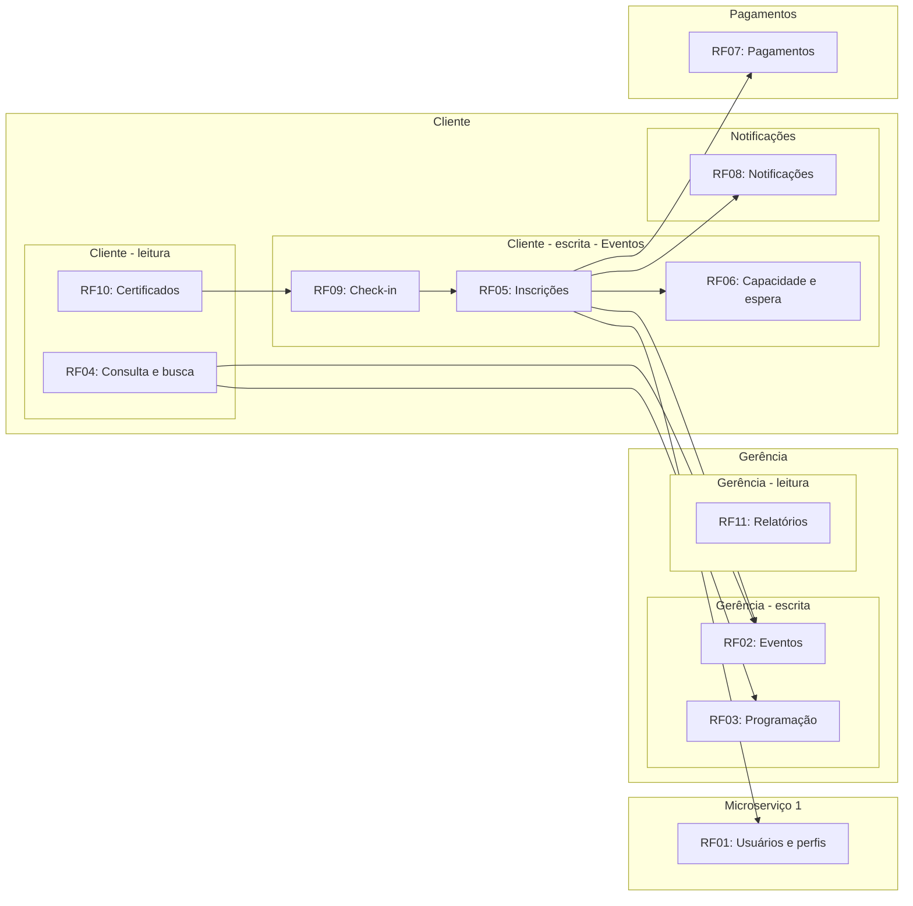

```mermaid
flowchart LR
    RF01[RF01: Usuários e perfis]
    RF02[RF02: Eventos]
    RF03[RF03: Programação]
    RF04[RF04: Consulta e busca]
    RF05[RF05: Inscrições]
    RF06[RF06: Capacidade e espera]
    RF07[RF07: Pagamentos]
    RF08[RF08: Notificações]
    RF09[RF09: Check-in]
    RF10[RF10: Certificados]
    RF11[RF11: Relatórios]
    subgraph Microserviço 1
        RF01
    end
  subgraph Gerência
    subgraph Gerência - escrita
        RF01
        RF02
        RF03
    end
    subgraph Gerência - leitura
        RF11
    end
  end
  subgraph Cliente
    subgraph Cliente - leitura
        RF04
        RF10
    end
    subgraph Cliente - escrita - Eventos
        direction RL
        RF05
        RF06
        RF09
    end
    subgraph Notificações
        RF08
    end
  end
  subgraph Pagamentos
    RF07
  end
  RF04 --> RF02 &  RF03
  RF05 --> RF01 &  RF02
  RF05 --> RF06
  RF05 --> RF07
  RF05 --> RF08
  RF09 --> RF05
  RF10 --> RF09
```