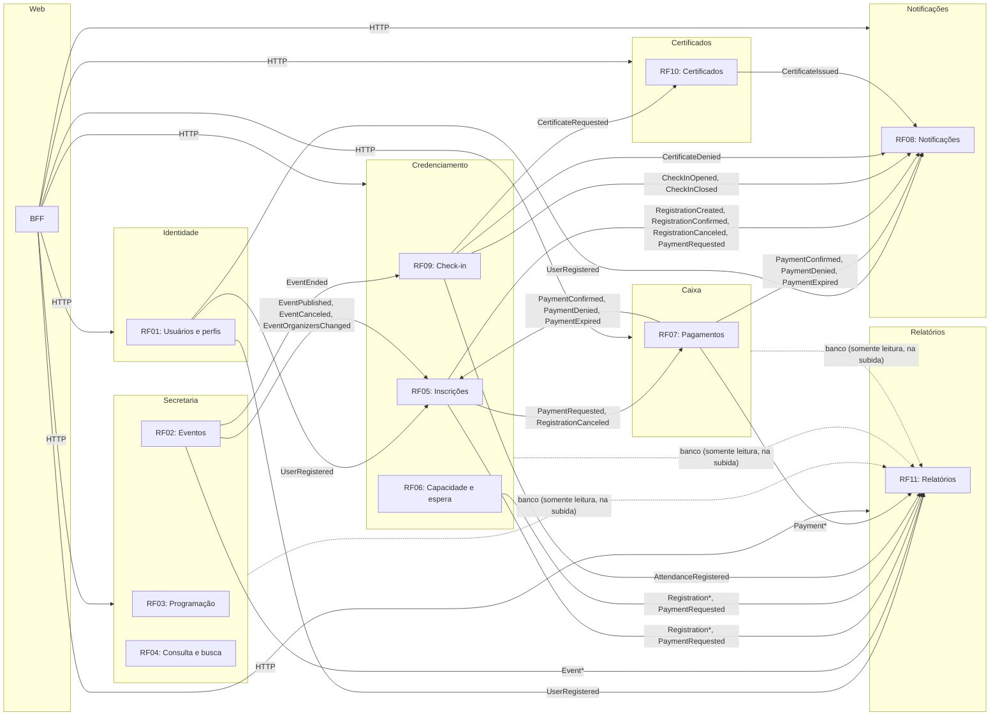

```mermaid
flowchart LR
    RF01[RF01: Usuários e perfis]
    RF02[RF02: Eventos]
    RF03[RF03: Programação]
    RF04[RF04: Consulta e busca]
    RF05[RF05: Inscrições]
    RF06[RF06: Capacidade e espera]
    RF07[RF07: Pagamentos]
    RF08[RF08: Notificações]
    RF09[RF09: Check-in]
    RF10[RF10: Certificados]
    RF11[RF11: Relatórios]
    subgraph Web
        BFF
    end
    subgraph Identidade
        RF01
    end
    subgraph Secretaria
        RF02
        RF03
        RF04
    end
    subgraph Certificados
        RF10
    end
    subgraph Credenciamento
        RF05
        RF06
        RF09
    end
    subgraph Relatórios
        RF11
    end
    subgraph Caixa
      RF07
    end
    subgraph Notificações
      RF08
    end
    %% A --> B: A emite uma mensagem que B consome. Dependências dentro de um mesmo serviço não aparecem.
    %% Linha tracejada: leitura direta de banco (bootstrap do reports), fora do padrão.
    BFF -- HTTP --> Identidade & Secretaria & Credenciamento & Caixa & Certificados & Relatórios & Notificações
    RF01 -- UserRegistered --> RF05 & RF08 & RF11
    RF02 -- "EventPublished, EventCanceled, EventOrganizersChanged" --> RF05
    RF02 -- EventEnded --> RF09
    RF02 -- "Event*" --> RF11
    RF05 -- "PaymentRequested, RegistrationCanceled" --> RF07
    RF07 -- "PaymentConfirmed, PaymentDenied, PaymentExpired" --> RF05
    RF07 -- "PaymentConfirmed, PaymentDenied, PaymentExpired" --> RF08
    RF05 -- "RegistrationCreated, RegistrationConfirmed, RegistrationCanceled, PaymentRequested" --> RF08
    RF09 -- "CheckInOpened, CheckInClosed" --> RF08
    RF09 -- CertificateRequested --> RF10
    RF09 -- CertificateDenied --> RF08
    RF10 -- CertificateIssued --> RF08
    RF05 & RF06 -- "Registration*, PaymentRequested" --> RF11
    RF09 -- AttendanceRegistered --> RF11
    RF07 -- "Payment*" --> RF11
    Secretaria & Credenciamento & Caixa -. "banco (somente leitura, na subida)" .-> RF11
```
